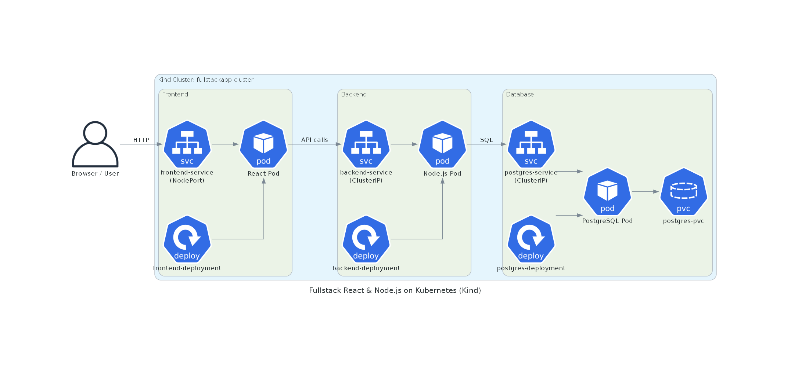

# Fullstack React & Node.js App on Kubernetes

This project demonstrates how to deploy a fullstack React frontend, Node.js backend, and PostgreSQL database on a local Kubernetes cluster using Kind.

---

## Project Structure

fullstack-react/
├── backend/          # Node.js backend
├── frontend/         # React frontend
├── k8s/              # Kubernetes deployment and service YAMLs
└── docker-compose.yml  # Optional for local Docker testing

---

## Prerequisites

- [Docker](https://www.docker.com/get-started)
- [Kind](https://kind.sigs.k8s.io/)
- [Kubectl](https://kubernetes.io/docs/tasks/tools/)
- Optional: Node.js and npm for local testing

---

## Setup Instructions

### Build Docker Images

docker build -t fullstack-react-back ./backend
docker build -t fullstack-react-front ./frontend

###  Load Images into Kind Cluster

kind load docker-image fullstack-react-back --name fullstackapp-cluster
kind load docker-image fullstack-react-front --name fullstackapp-cluster

### Deploy Kubernetes Resources

kubectl apply -f k8s/postgres.yaml
kubectl apply -f k8s/postgres-service.yaml

kubectl apply -f k8s/backend.yaml
kubectl apply -f k8s/backend-service.yaml

kubectl apply -f k8s/frontend.yaml
kubectl apply -f k8s/frontend-service.yaml
